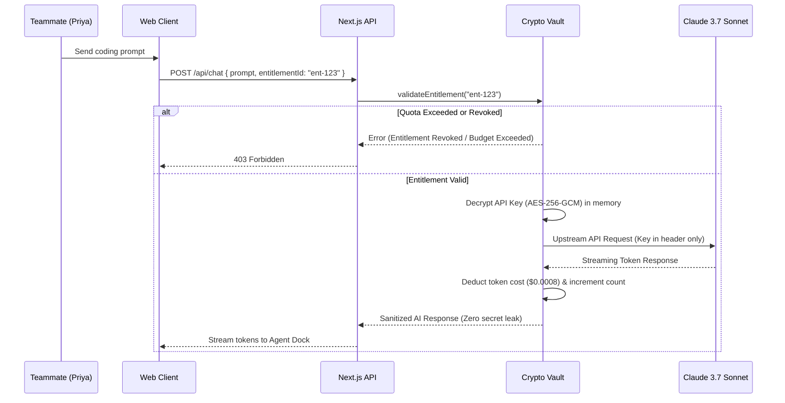
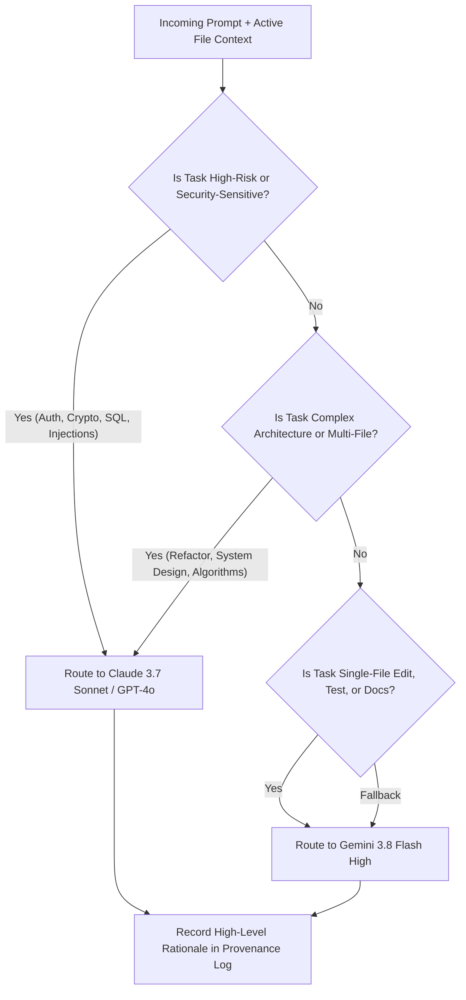

# Architecture & Technical Design: Project Intelligence Fabric

This document details the architectural principles, component interactions, cryptographic guarantees, and data flows governing **Project Intelligence Fabric (MyIDE)**.

---

## 1. High-Level System Architecture

Project Intelligence Fabric is designed as a modular, client-server AI developer environment built on Next.js 15 App Router and React 19.

```mermaid
flowchart TD
    subgraph Client ["Client Layer (Browser)"]
        UI[IDE Studio Shell]
        Monaco[Monaco Multi-Tab Editor]
        DiffViewer[Side-by-Side Diff Engine]
        AgentDock[Agent Dock - 8 Roles]
        Terminal[Sandboxed Terminal Pane]
        RouterUI[Model Selector Modal]
        IntelUI[Project Intelligence Modal]
        VaultUI[Zero-Leak Entitlements Hub]
    end

    subgraph API ["Next.js 15 API & Service Layer"]
        FilesAPI["/api/files (File CRUD)"]
        TerminalAPI["/api/terminal (Command Runner)"]
        RouterEngine["src/lib/router.ts (Quality Router)"]
        CryptoVault["src/lib/crypto.ts (AES-256-GCM)"]
        StorageEngine["src/lib/storage.ts (Storage & Memory)"]
        ObsidianBridge["/api/obsidian (Selective Vault Connector)"]
        GitAPI["/api/git (Diff & Provenance)"]
    end

    subgraph Data ["Local Storage & External Systems"]
        FS[Workspace Filesystem]
        SecretStore[data/credentials.json (Encrypted)]
        MemoryStore[data/intelligence.json (ADRs)]
        ObsidianVault["Obsidian Vault (C:\projects\orchestra-brain)"]
        ExternalLLMs["External LLMs (Gemini, Claude, GPT-4o, Local Ollama)"]
    end

    UI --> Monaco
    UI --> AgentDock
    UI --> Terminal
    UI --> DiffViewer
    UI --> RouterUI
    UI --> IntelUI
    UI --> VaultUI

    Monaco <--> FilesAPI
    Terminal <--> TerminalAPI
    AgentDock <--> RouterEngine
    VaultUI <--> CryptoVault
    IntelUI <--> StorageEngine
    RouterUI <--> RouterEngine
    UI <--> ObsidianBridge
    DiffViewer <--> GitAPI

    FilesAPI <--> FS
    TerminalAPI <--> FS
    CryptoVault <--> SecretStore
    StorageEngine <--> MemoryStore
    ObsidianBridge <--> ObsidianVault
    RouterEngine --> ExternalLLMs
```

---

## 2. Zero-Leak Credential & Entitlement Boundary

One of the foundational design requirements of the IDE is the **Zero-Leak Security Model**: raw API credentials must never be exposed to teammates, client browsers, or AI prompts.

### 2.1 The Entitlement Chain

The system models access using a strict five-tier abstraction:

$$\text{Credential} \longrightarrow \text{Provider} \longrightarrow \text{Capability} \longrightarrow \text{Entitlement} \longrightarrow \text{Agent}$$

1. **Credential**: Raw secret (e.g. `sk-ant-api03-...`). Stored exclusively on the server in encrypted form. Never leaves the server boundary.
2. **Provider**: The upstream API service (`anthropic`, `google`, `openai`, `local`).
3. **Capability**: A named, configured service resource (e.g. `Friend A — Claude 3.7 Sonnet`, `Lab RTX 4090 GPU Node`).
4. **Entitlement**: A scoped, time-bound, budget-constrained authorization granted to a teammate.
5. **Agent**: The active agent role making tool or inference requests under the granted entitlement.

### 2.2 Cryptographic Specification

Encryption is implemented in `src/lib/crypto.ts` using authenticated symmetric cryptography:

* **Algorithm**: `AES-256-GCM` (Galois/Counter Mode).
* **Key Derivation**: PBKDF2 with 100,000 iterations, SHA-512 digest, and a cryptographically random 16-byte salt per secret.
* **Initialization Vector (IV)**: 12 bytes randomly generated per encryption operation via `crypto.randomBytes(12)`.
* **Authentication Tag**: 16 bytes authentication tag generated by GCM ensuring ciphertext integrity and tamper detection.
* **Payload Format**: `hex(salt) + ":" + hex(iv) + ":" + hex(authTag) + ":" + hex(ciphertext)`.



### 2.3 Emergency Revocation Kill Switch

The IDE provides both granular and global revocation primitives:
* **`handleRevokeOne(entitlementId)`**: Sets the entitlement status to `revoked` and immediately invalidates in-flight sessions.
* **`handleRevokeAll()`**: Atomic emergency kill switch that marks all granted capabilities across all teammates as `revoked`.

---

## 3. Intelligent Model-Selection Architecture

The IDE provides three distinct model selection modes to balance developer velocity, reasoning depth, and cost efficiency.

### 3.1 Mode Comparison Matrix

| Mode | Trigger | Behavior | Switching Policy |
| :--- | :--- | :--- | :--- |
| **Mode A (Auto)** | User selects *Auto Router* | Analyzes task complexity, risk, security implications, and context size. | **Quality-First**. Selects the best model for the task. |
| **Mode B (Manual)** | User selects specific model (e.g. *Claude 3.7 Sonnet*) | Locks all agent operations to the user-chosen model. | **Strict Adherence**. Never automatically switches away. |
| **Mode C (Capability)** | User selects a shared team capability | Strictly executes via the granted entitlement. | **Strict Binding**. Quota-checked, never falls back. |

### 3.2 Mode A Routing Decision Tree



### 3.3 Explainable Routing ("Why?")

To build developer trust without revealing proprietary model prompts or raw chain-of-thought tokens, every routing decision produces a structured rationale:

```json
{
  "selectedModelId": "gemini-3.8-flash-high",
  "reasoning": "Selected because the current task is focused on single-file code inspection and local prototyping where a fast, high-reasoning model yields the best developer velocity without token waste.",
  "evaluatedCriteria": {
    "taskComplexity": "standard",
    "riskLevel": "low",
    "qualityOverCost": true,
    "multiFileImpact": false,
    "authOrSecurityCritical": false
  }
}
```

---

## 4. Monaco Code Studio & Diff Review Engine

* **Editor Core**: Powered by Monaco (`@monaco-editor/react`), providing native VS Code keybindings, multi-cursor editing, IntelliSense, and language server support for 50+ languages.
* **Theme Specification**: Custom `Dark Obsidian` theme tailored with slate backgrounds (`#090D16`), deep navy containers (`#111726`), syntax highlights in violet, cyan, emerald, and amber, and subtle borders (`rgba(255,255,255,0.08)`).
* **Side-by-Side Diff Editor**:
  When an AI agent proposes a code edit, the IDE does not blindly overwrite the user's files. Instead, it mounts Monaco's `DiffEditor`:
  * Left pane: Current working tree file (`original`).
  * Right pane: Agent's proposed modifications (`modified`).
  * Top bar: Explicit **Accept Changes** and **Reject Changes** actions.

---

## 5. Selective Obsidian Brain Synchronization

The IDE interfaces directly with the user's Obsidian Knowledge Vault at `C:\projects\orchestra-brain`:

1. **Vault Discovery**: Scans allowlisted directories (`memory/`, `templates/`, `projects/`, root markdown files).
2. **Selective Scoping (Privacy Guard)**: Teammates selectively check which files to link into the current programming context.
3. **Excluded Directories**: Personal diaries, career notes, and private thoughts (`career/`, `finances/`) are permanently excluded by the file discovery filter in `src/app/api/obsidian/route.ts`.
4. **Project Lifecycle Hook**: When a new project is created, it automatically scaffolds `projects/<slug>/idea.md` and executes `sync-projects.py` to update `START HERE.md` and `routes.md`.

---

## 6. Git Provenance & Conventional Commits

Every AI intervention produces an indelible audit trail recorded in `data/intelligence.json`:
* **User prompt & timestamp**
* **Agent role invoked** (`Coder`, `Security`, etc.)
* **Model & Capability used**
* **Files inspected & modified**
* **Estimated token cost & execution latency**
* **Automated verification result** (`passed` | `failed`)

This audit trail feeds directly into the **Git Diff Viewer Modal**, which allows one-click generation of conventional commit messages (`feat(vision): optimize inference pipeline`).